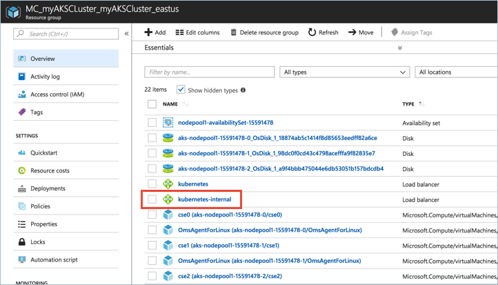

# Use an internal load balancer with Azure Kubernetes Service (AKS)

Internal load balancing makes a Kubernetes service accessible to applications running in the same virtual network as the Kubernetes cluster. This document details creating an internal load balancer with Azure Kubernetes Service (AKS).

## Create internal load balancer

To create an internal load balancer, build a service manifest with the service type `LoadBalancer` and the `azure-load-balancer-internal` annotation as seen in the following sample.

```yaml
apiVersion: v1
kind: Service
metadata:
  name: azure-vote-front
  annotations:
    service.beta.kubernetes.io/azure-load-balancer-internal: "true"
spec:
  type: LoadBalancer
  ports:
  - port: 80
  selector:
    app: azure-vote-front
```

Once deployed, an Azure load balancer is created and made available on the same virtual network as the AKS cluster.



When retrieving the service details, the IP address in the `EXTERNAL-IP` column is the IP address of the internal load balancer.

```console
$ kubectl get service azure-vote-front

NAME               TYPE           CLUSTER-IP    EXTERNAL-IP   PORT(S)        AGE
azure-vote-front   LoadBalancer   10.0.248.59   10.240.0.7    80:30555/TCP   10s
```

## Specify an IP address

If you would like to use a specific IP address with the internal load balancer, add the `loadBalancerIP` property to the load balancer spec. The specified IP address must reside in the same subnet as the AKS cluster and must not already be assigned to a resource.

```yaml
apiVersion: v1
kind: Service
metadata:
  name: azure-vote-front
  annotations:
    service.beta.kubernetes.io/azure-load-balancer-internal: "true"
spec:
  type: LoadBalancer
  loadBalancerIP: 10.240.0.25
  ports:
  - port: 80
  selector:
    app: azure-vote-front
```

When retrieving the service details, the IP address on the `EXTERNAL-IP` should reflect the specified IP address.

```console
$ kubectl get service azure-vote-front

NAME               TYPE           CLUSTER-IP     EXTERNAL-IP   PORT(S)        AGE
azure-vote-front   LoadBalancer   10.0.184.168   10.240.0.25   80:30225/TCP   4m
```

## Delete the load balancer

When all services using the internal load balancer have been deleted, the load balancer itself is also deleted.

## Next steps

Learn more about Kubernetes services at the [Kubernetes services documentation][kubernetes-services].

<!-- LINKS - External -->
[kubernetes-services]: https://kubernetes.io/docs/concepts/services-networking/service/