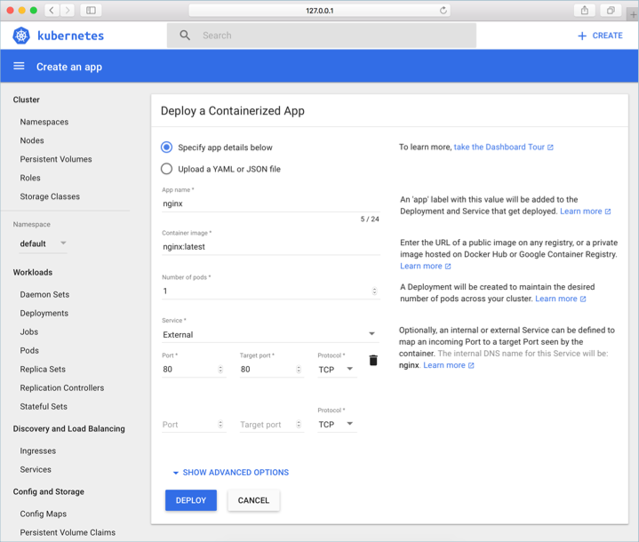
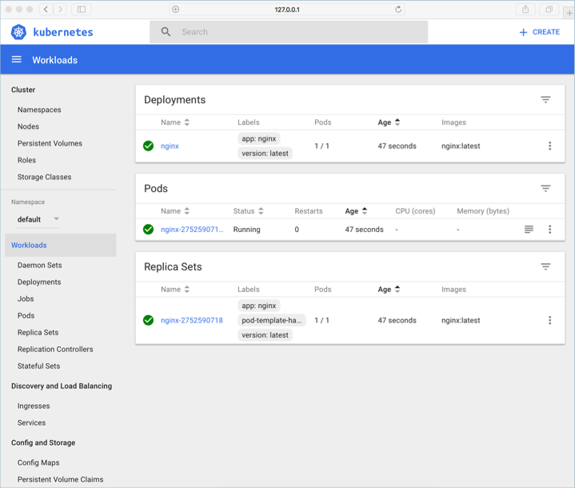
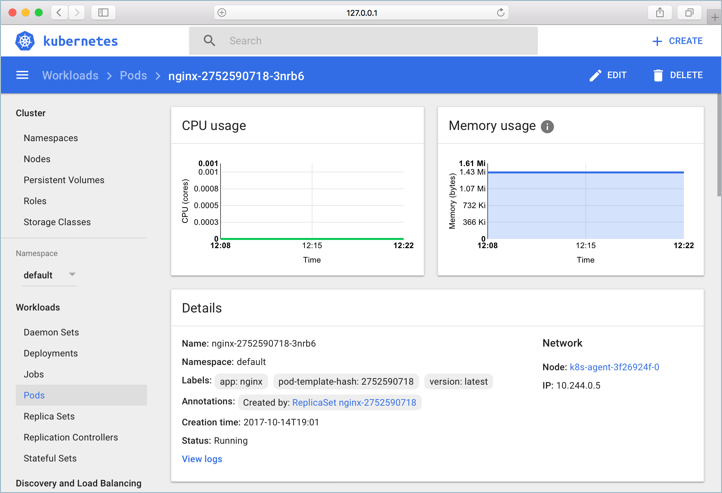
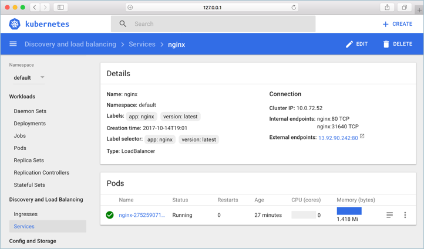
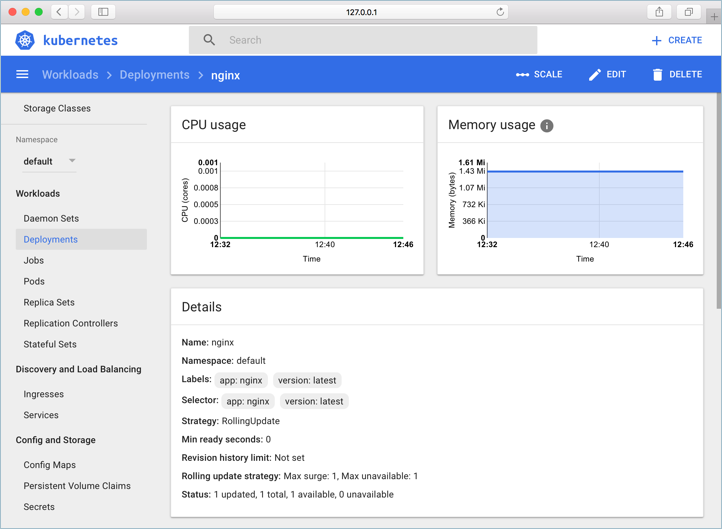
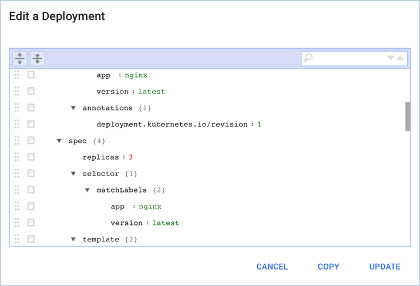

# Kubernetes dashboard with Azure Kubernetes Service (AKS)

The Azure CLI can be used to start the Kubernetes Dashboard. This document walks through starting the Kubernetes dashboard with the Azure CLI, and also walks through some basic dashboard operations. For more information on the Kubernetes dashboard see, [Kubernetes Web UI Dashboard][kubernetes-dashboard].

## Before you begin

The steps detailed in this document assume that you have created an AKS cluster and have established a kubectl connection with the cluster. If you need these items see, the [AKS quickstart][aks-quickstart].

You also need the Azure CLI version 2.0.27 or later installed and configured. Run az --version to find the version. If you need to install or upgrade, see [Install Azure CLI][install-azure-cli].

## Start Kubernetes dashboard

Use the `az aks browse` command to start the Kubernetes dashboard. When running this command, replace the resource group and cluster name.

```azurecli
az aks browse --resource-group myResourceGroup --name myAKSCluster
```

This command creates a proxy between your development system and the Kubernetes API, and opens a web browser to the Kubernetes dashboard.

## Run an application

In the Kubernetes dashboard, click the **Create** button in the upper right window. Give the deployment the name `nginx` and enter `nginx:latest` for the images name. Under **Service**, select **External** and enter `80` for both the port and target port.

When ready, click **Deploy** to create the deployment.



## View the application

Status about the application can be seen on the Kubernetes dashboard. Once the application is running, each component has a green checkbox next to it.



To see more information about the application pods, click on **Pods** in the left-hand menu, and then select the **NGINX** pod. Here you can see pod-specific information such as resource consumption.



To find the IP address of the application, click on **Services** in the left-hand menu, and then select the **NGINX** service.



## Edit the application

In addition to creating and viewing applications, the Kubernetes dashboard can be used to edit and update application deployments.

To edit a deployment, click **Deployments** in the left-hand menu, and then select the **NGINX** deployment. Finally, select **Edit** in the upper right-hand navigation bar.



Locate the `spec.replica` value, which should be 1, change this value to 3. In doing so, the replica count of the NGINX deployment is increased from 1 to 3.

Select **Update** when ready.



## Next steps

For more information about the Kubernetes dashboard, see the Kubernetes documentation.

> [!div class="nextstepaction"]
> [Kubernetes Web UI Dashboard][kubernetes-dashboard]

<!-- LINKS - external -->
[kubernetes-dashboard]: https://kubernetes.io/docs/tasks/access-application-cluster/web-ui-dashboard/

<!-- LINKS - internal -->
[aks-quickstart]: ./kubernetes-walkthrough.md
[install-azure-cli]: /cli/azure/install-azure-cli