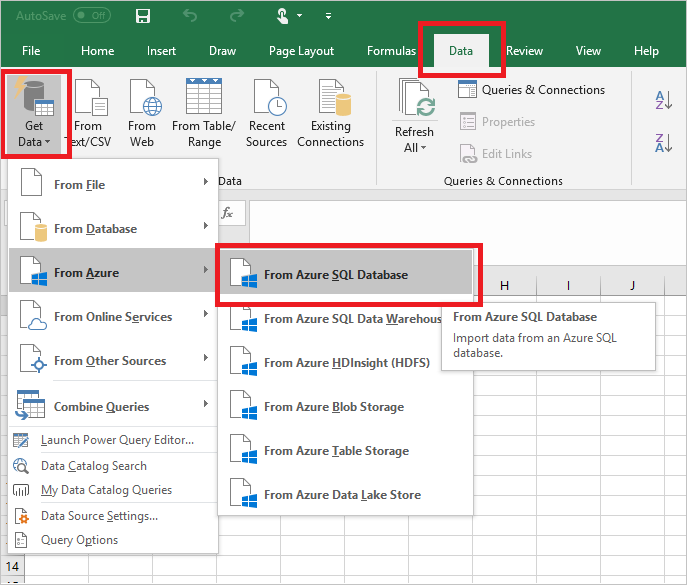
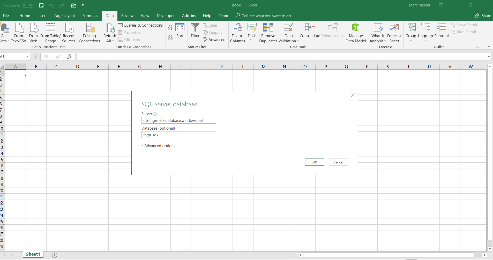
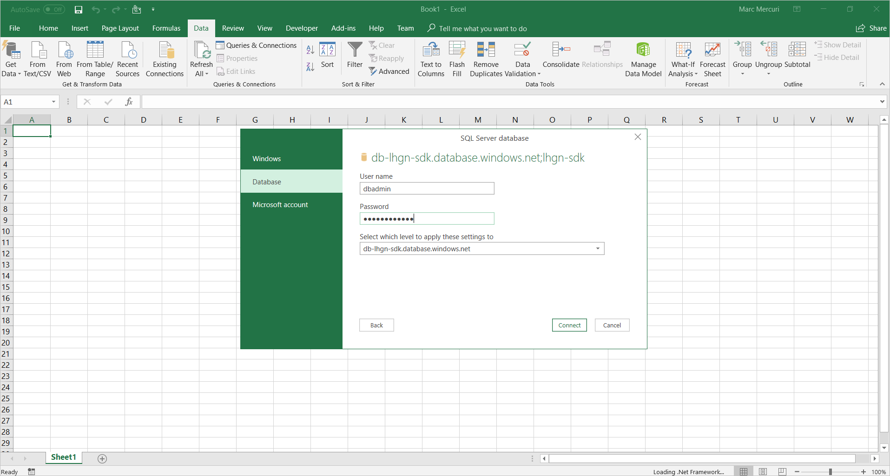
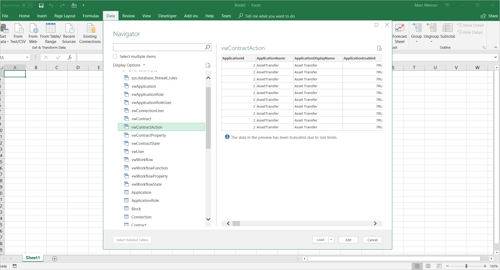
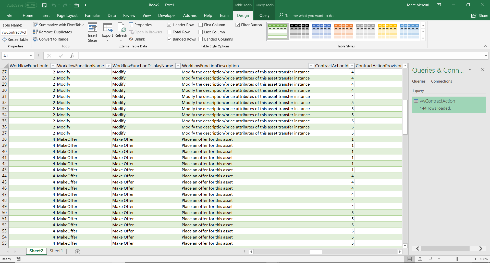

# View Azure Blockchain Workbench data with Microsoft Excel

You can use Microsoft Excel to view data in Azure Blockchain Workbench's SQL DB. This article provides the steps you need to:

* Connect to the Blockchain Workbench database from Microsoft Excel
* Look at Blockchain Workbench database tables and views
* Load Blockchain Workbench view data into Excel

## Connect to the Blockchain Workbench database

To connect to a Blockchain Workbench database:

1. Open Microsoft Excel.
2. On the **Data** tab, choose **Get Data**.
3. Select **From Azure** and then select **From Azure SQL Database**.

   

4. In the **SQL Server database** dialog box:

    * For **Server**, enter the name of the Blockchain Workbench server.
    * For **Database (optional)**, enter the name of the database.

   

5. In the **SQL Server database** dialog navigation bar, select     **Database**. Enter your **Username** and **Password**, and then    select **Connect**.

    > [!NOTE]
    > If you're using the credentials created during the Azure Blockchain Workbench deployment process, the **User name** is `dbadmin`. The **Password** is the one you created when you deployed the Blockchain Workbench.
    
   

## Look at database tables and views

The Excel Navigator dialog opens after you connect to the database. You can use the Navigator to look at the tables and views in the database. The views are designed for reporting and their names are prefixed with **vw**.

   

## Load view data into an Excel workbook

The next example shows how you can load data from a view into an Excel workbook.

1. In the **Navigator** scroll bar, select the **vwContractAction** view. The **vwContractAction** preview shows all the actions related to a contract in the Blockchain Workbench database.
2. Select **Load** to retrieve all the data in the view and put it in your Excel workbook.

   

Now that you have the data loaded, you can use Excel features to create your own reports using the metadata and transaction data from the Azure Blockchain Workbench database.

## Next steps

* [Database views in Azure Blockchain Workbench](blockchain-workbench-database-views.md)