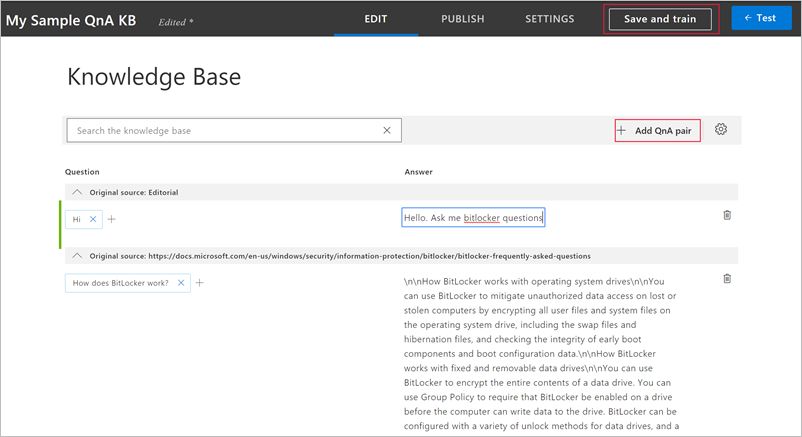
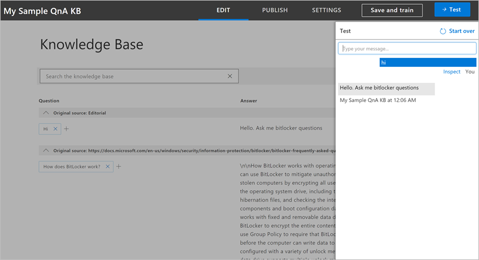

# Create-Train-Publish your knowledge base

A QnA Maker knowledge base can be created from pre-existing semi-structured content such as FAQs or product manuals. This QnA Maker knowledge base is created from a simple FAQ webpage and is able to answer questions on BitLocker key recovery.

## Prerequisite
> [!div class="checklist"]
> * If you don't have an Azure subscription, create a [free account](https://azure.microsoft.com/free/?WT.mc_id=A261C142F) before you begin.

## Create a QnA Maker Knowledge Base

1. Log in to QnAMaker.ai with your Azure credentials.

2. On the QnA Maker website, select **Create new knowledge base**.

    

3. In the create page, step 1, select **Create a QnA service**. This will direct you to Azure portal where you need to set up a QnA Maker service in your subscription. Learn about how to do that here.

4. Once you've successfully created a new QnA Maker service in Azure, select it from the drop-downs.

    

5. Name your KB "My Sample QnA KB".

6. Next, to add content to your KB, we will select three types of data sources. Add the 
[BitLocker Recovery FAQ](https://docs.microsoft.com/en-us/windows/security/information-protection/bitlocker/bitlocker-frequently-asked-questions) URL in the URL box.

    

7. Click on **Create your KB**.

8. When the KB is being created, you will see the popup window. It takes a few minutes for the extraction process to read the HTML page and identify questions and answers.

9. Once the KB is successfully created, it opens the 'Knowledge Base' page where you can edit the contents of the knowledge base.

10. Click on **Add QnA Pair** to add a new row in the Editorial section of the Knowledge Base. Enter the following:

    

11. Edits will not be retained unless they are saved. Select **Save and train** on the top right to save the edits your just made and to train the QnA Maker model.

12. Select **Test** on the top right corner to test that the changes made have taken effect.
Type in 'hi there' in the box and press enter.

13. Select **Inspect** to examine the response in more details. The test window is used to test your changes to the KB before they are published.

    

14. Dismiss the Test pop-out by clicking on 'Test' again. Open the Publish tab.

14. Click on **Publish**.

15. The QnA Maker service has now been successfully published. The endpoint can be used in your application or bot code.

    

## Next steps

> [!div class="nextstepaction"]
> [Create a knowledge base](../How-To/create-knowledge-base.md)
